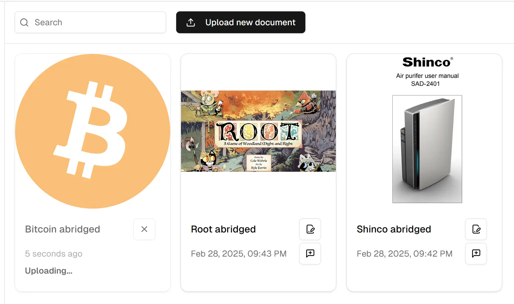
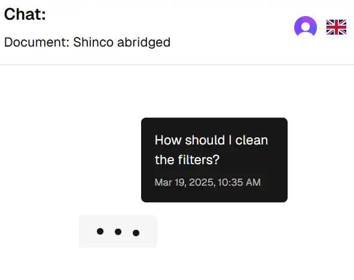
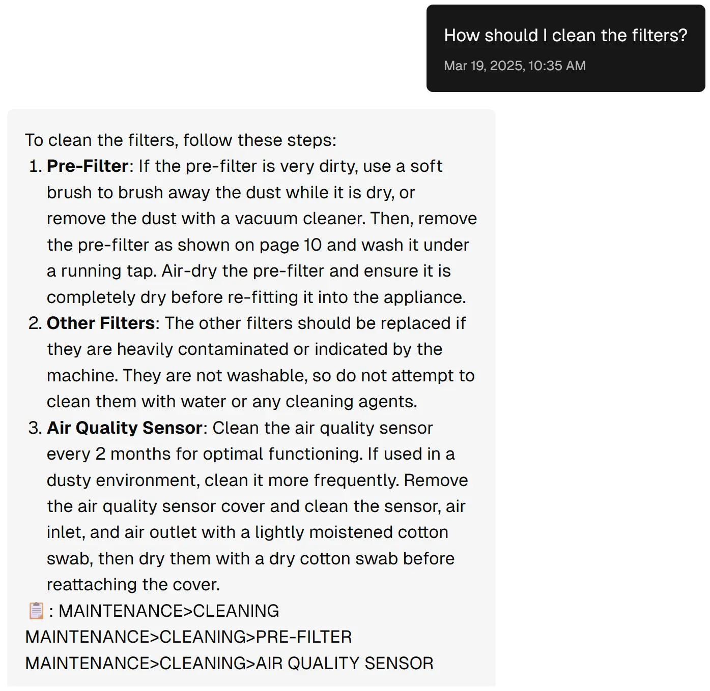
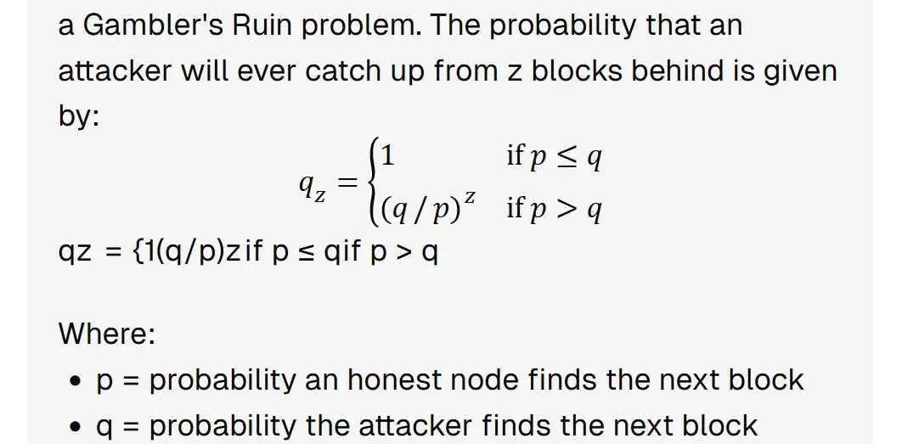

# Chat with Manuals

This is an app I created to "chat" with PDF documents, specifically manuals. Usually, manuals are useful beyond the first read. For instance, if you purchased a product and on a given day you want to review how a specific feature works, you will reach the manual and read that section again. But that's a problem if the manual is poorly written or is very long, because it can be a very time consuming thing to do. Thus, I built this app!

I find it very useful to upload a PDF and use AI to search the relevant parts of the document for me, instead of me scrolling through endless pages until I find my answer. For example, you can upload an air conditioner manual and ask it "how do I properly clean the filters?". And the AI will just tell you! Magic! 🪄

Well, not really, this isn't novel at all, it's called a [Retrieval Augmented Generation App (RAG)](https://blogs.nvidia.com/blog/what-is-retrieval-augmented-generation/). But I created because I tested different prebuilt RAGs (like OpenAI Assistant, simple chunking and Gemini 1 Million context window) and they suffered from the following problems:

- They hallucinated a lot (OpenAI and simple chunking).
- In the case of Gemini 1M context, the latency per question was around 60 seconds (this is very, very slow).
- They weren't answering in the tone and style I wanted to, and my app allows using any model and controlling the system prompt to customize the responses.

I did some research and found that AI RAG apps are as good as the context you give them. So I created this app, which retrieves context specifically from documents shaped like product or board game manuals, that is, with a title and sections with subtitles that don't go longer than two or three pages. With these constraints in place, I've built a RAG that almost doesn't hallucinate and is fast enough 😁.

This is my first project with AI, I did it to improve my Full Stack skills and learn how to integrate AI into my apps. I'm glad I could finish it to a state where its actually useful for my needs. Feel free to use it however you want though!

🎥 [**See it in action! (video in English)**](https://youtu.be/KfxJLpu_UnA) 🎥

Now, if you want to delve deep on how this app works and discover how everything is interconnected I invite you to continue reading this document. I'll use "we" as a pronoun throughout the explanation because it feels the most natural to me, having worked on several companies already, but the app has been made entirely by me at this point.

<!-- index-start -->
## Index

- [Stack](#stack)
- [How does this RAG work?](#how-does-this-rag-work)
  - [Authentication](#authentication)
  - [Uploading the document](#uploading-the-document)
  - [Parsing the Document from PDF to Markdown](#parsing-the-document-from-pdf-to-markdown)
  - [Transforming Markdown into Sections](#transforming-markdown-into-sections)
  - [Chunking Sections](#chunking-sections)
  - [Embedding into Chroma DB](#embedding-into-chroma-db)
  - [Creating the Document entry](#creating-the-document-entry)
  - [Notifying the user](#notifying-the-user)
  - [Starting a chat conversation](#starting-a-chat-conversation)
  - [Processing the message and gathering context](#processing-the-message-and-gathering-context)
  - [Generating an answer](#generating-an-answer)
  - [Answering the user](#answering-the-user)
- [Future improvements](#future-improvements)
- [Structure of this repository](#structure-of-this-repository)
- [Motivation](#motivation)
<!-- index-end -->

## Stack

### Frontend 🖥️

- [**Next.js Pages Router**](https://nextjs.org/docs/pages/getting-started), the most widely used Full Stack React framework.
- [**Shadcn/ui**](https://ui.shadcn.com/) to reuse robust and accessible frontend components.
- [**Tailwind CSS**](https://tailwindcss.com/) to ensure a great consistent layout.
- [**React Hook Form**](https://react-hook-form.com/) for robust frontend validated forms.
- [**react-markdown**](https://github.com/remarkjs/react-markdown) to display the AI answers properly, even with LaTeX formulas!
- [**Lucide Icons**](https://lucide.dev/), easy to use and look great.
- [**next-intl**](https://next-intl.dev/docs/getting-started/pages-router) to ensure all the app is properly translated.
- [**usehooks-ts**](https://usehooks-ts.com/), for a great collection of useful hooks.

### Backend 🔌

- [**TRPC**](https://trpc.io/) to ensure all the API is type safe and avoid managing the async state manually.
- [**Zod**](https://zod.dev/) to make the backend super robust and error free.
- [**LangChain**](https://js.langchain.com/docs/introduction/) for integrating AI with the app.
- [**Marked**](https://marked.js.org/) with [marked-plaintify](https://github.com/bent10/marked-extensions/tree/main/packages/plaintify) to parse the Markdown into structured JSON sections.
- [**formidable**](https://github.com/node-formidable/formidable) to parse files efficiently and without exposing the system to potentially infected files before scanning them with ClamAV.
- [**Sharp**](https://sharp.pixelplumbing.com/) to transform images for the web in every situation so the app is as fast as possible.

### External services ↗️

- [**Clerk**](https://clerk.com/) for quick and robust authentication.
- [**LlamaParse**](https://docs.llamaindex.ai/en/stable/llama_cloud/llama_parse/) to parse PDF documents to Markdown with AI.
- [**Trigger.dev**](https://trigger.dev/) to manage CPU intensive background jobs with an excellent dashboard.
- [**ClamAV**](https://docs.clamav.net/) to ensure uploaded files don't contain malware.


### Database & Data Management 💾

- [**Prisma**](https://www.prisma.io/) PostgreSQL ORM to protect against vulnerabilities and have type safe queries.
- [**Chroma DB**](https://www.trychroma.com/), great vector database specifically designed for AI apps.

### Development Tools ⚙️

- [**Cursor IDE**](https://www.cursor.com/). The best AI-powered IDE I found.
- [**TypeScript**](https://www.typescriptlang.org/). I just don't see any reason not to use it.
- [**ESLint for TypeScript**](https://typescript-eslint.io/). Mandatory, who wants errors that they could catch before deploying?
- [**Prettier**](https://prettier.io/). I like my code consistently styled.
- [**concurrently**](https://github.com/open-cli-tools/concurrently), very nice tool to orchestrate many commands at once.
- [**commitlint**](https://commitlint.js.org/), to fully embrace Conventional Commits.
- [**Husky**](https://typicode.github.io/husky/) with [lint-staged](https://github.com/lint-staged/lint-staged). Because every commit should be as clean as possible.
- [**Docker**](https://www.docker.com/). Containers make my life much easier.
- [**T3 Stack**](https://create.t3.gg/). To quickstart everything with the basics already set up.

## How does this RAG work?

### Authentication

The first time the user opens the app it's redirected to Clerk to sign up via [middleware](https://github.com/irian-codes/chat-with-manuals/blob/356d5bf94433dfb5fa29a93d4d68a254563258e9/fullstack-app/src/middleware.ts). We chose Clerk because it's a great solution to have a robust authentication flow. Also, if the app is ever deployed to production, we would have to charge a subscription per user, which would cover the costs. So it's an ideal fit!

When the user is registered on Clerk, it's automatically redirected to the app again. We now check if a user exists on the database, if it doesn't, it'll be automatically created by [the SSR code](https://github.com/irian-codes/chat-with-manuals/blob/356d5bf94433dfb5fa29a93d4d68a254563258e9/fullstack-app/src/pages/index.tsx#L32). Making the whole process quick, opaque and easy.

The user now is presented with an empty dashboard and prompted to upload their first PDF document using a frontend validated form with react-hook-form.

### Uploading the document

The user uploads a document and we send it to the [`uploadDocument`](https://github.com/irian-codes/chat-with-manuals/blob/356d5bf94433dfb5fa29a93d4d68a254563258e9/fullstack-app/src/pages/api/uploadDocument.ts) API Route. As you can see, after the authorization check, the file is scanned for viruses using ClamAV, there's rate limiting implemented and the file is parsed using Formidable to ensure a robust and secure implementation.

This is the first challenge we had to address, as I realized [TRPC doesn't allow file uploads](https://github.com/trpc/trpc/issues/1937)! So I had to create an API Route only to handle file uploads and then call the [`parseDocument`](https://github.com/irian-codes/chat-with-manuals/blob/356d5bf94433dfb5fa29a93d4d68a254563258e9/fullstack-app/src/server/api/routers/documents.ts) TRPC procedure within the API Route.

Why did I choose this solution? I could have put all the code inside the API Route instead of splitting it between the route and TRPC. But I think the API Route is a workaround to what I actually wanted, which is to use TRPC throughout the whole app. In order to minimize the code deviating from the norm, I think it's better to have only the minimum necessary code inside the API Route and the rest in the TRPC procedure. This way, if they ever implement support for this the code will be easy to migrate.

### Parsing the Document from PDF to Markdown

When the document is sent to the TRPC procedure, a [`PendingDocument`](https://github.com/irian-codes/chat-with-manuals/blob/356d5bf94433dfb5fa29a93d4d68a254563258e9/fullstack-app/prisma/schema.prisma#L62) database record is created with Prisma ORM with all the necessary file details.

This is necessary, because parsing a document is a complex task that requires many steps, some of them are CPU intensive, and [blocking Node.js Event Loop is a very bad idea](https://nodejs.org/en/learn/asynchronous-work/dont-block-the-event-loop#why-should-i-avoid-blocking-the-event-loop-and-the-worker-pool). That's why we delegate the parsing task to [a background job](https://github.com/irian-codes/chat-with-manuals/blob/356d5bf94433dfb5fa29a93d4d68a254563258e9/fullstack-app/src/server/trigger/documents.ts) handled by Trigger.dev that will fetch the `PendingDocument` entry and work from there. I found it an awesome tool!

The background job first sends the PDF file to LlamaParse parsing service. On the [`research` branch](https://github.com/irian-codes/chat-with-manuals/tree/research) we tried many PDF parsers, from layout ones to AI powered ones, and the clear winner for me is LlamaParse. It produces a good enough Markdown that in the beginning suffered from substantial hallucinations (that's why I started the [`experimental/improve-hallucinations` branch](https://github.com/irian-codes/chat-with-manuals/tree/experimental/improve-hallucinations)) but now seems much better! A few months in AI feel like years in other sectors... 😅

One way to mitigate hallucinations on LlamaParse is giving context to the parser. We've prompt engineered [different parsing prompts](https://github.com/irian-codes/chat-with-manuals/blob/356d5bf94433dfb5fa29a93d4d68a254563258e9/fullstack-app/src/server/utils/prompt.ts#L46) for each type of document, and the parsing is much better. Mainly because the AI knows in which format should parse each part of the document, as it's not the same parsing a research paper than a board game manual. More is explained on [this article](https://www.llamaindex.ai/blog/launching-the-first-genai-native-document-parsing-platform) of theirs.

Anyway, when the PDF is parsed, we receive the Markdown, we lint it and...

### Transforming Markdown into Sections

 We transform the Markdown into a JSON array of sections with [this function](https://github.com/irian-codes/chat-with-manuals/blob/2df3320d6d488928548f850ac192976488c75e38/fullstack-app/src/server/document/chunking.ts#L79). This is one of the most complex functions in the whole codebase, it took me time to get it right, but here it goes:

 1. We set up Marked with marked-plaintify extension because we want to remove any Markdown syntax on the text, as it doesn't embed well with our vector database.
 1. We iterate over each token that Marked detects in our Markdown string ([here](https://github.com/irian-codes/chat-with-manuals/blob/356d5bf94433dfb5fa29a93d4d68a254563258e9/fullstack-app/src/server/document/chunking.ts#L96)). This can be a title, a text, a blockquote or any other element that's supported. Whatever we find, it's transformed into plain text automatically and stored in the temporary object: `currentContent`.
 1. It's a Tree Data Structure, so to store a section, we need a `stack` of sections, because if we're processing subsections of a parent section, and we encounter sections like 1.1.1, 1.1.2 and then 1.2 we want to correctly nest the current section inside the JSON Section object. In the end, the resulting final sections JSON object will start with an array of level 1 sections (i.e. #) and nest all subsections on these parents (i.e. ##, ###, ...).

    To do this, first we clean `stack` to find the parent of the current section ([here](https://github.com/irian-codes/chat-with-manuals/blob/356d5bf94433dfb5fa29a93d4d68a254563258e9/fullstack-app/src/server/document/chunking.ts#L114)), if not found we set it as a level 1 section directly on `jsonStructure`, but if we find it, then we store it in its parent's `subsections` array. But this is for now an empty section. So the code proceeds to parse the rest of Markdown elements.

 1. If we encounter anything other than a header or a table, we just push it as a plain text into `currentContent.text`. When a table is encountered, we store it in a Map structure in `currentContent.tables`. We want to separate tables from the rest of the text so they don't get chunked mid table. And finally, if we encounter a header, we create the actual section object before continuing with this newly found section. Here's where the complexity comes in, and I think it'll be too long to explain in here in detail, so I'll leave you with the [commented code](https://github.com/irian-codes/chat-with-manuals/blob/356d5bf94433dfb5fa29a93d4d68a254563258e9/fullstack-app/src/server/document/chunking.ts#L151) if you want to know more, but essentially what it does is it fills the "gaps" between sections. Because in the sections tree maybe there's a gap between Section 1.2 and Section 1.3.1 (missing section 1.3) due to parsing errors, so to not break the structure it'll do it like `[1, 1>1.1, 1>1.2, 1>1.3>1.3.1]` and create a fake 1.3 section titled 'N/A'.
 1. When all the Marked tokens have been parsed, we return the final `jsonStructure`. And now we have an array of objects:

    ```ts
    type SectionNode = {
        id: string;
        type: 'section';
        title: string;
        level: number;
        headerRoute: string;
        headerRouteLevels: string;
        content: string;
        tables: Map<number, string>;
        subsections: SectionNode[];
    };
    ```

### Chunking Sections

Now that we have all sections parsed and correctly separated, we want to chunk them to store them into Chroma DB for similarity search later.

The chunking process [here](https://github.com/irian-codes/chat-with-manuals/blob/356d5bf94433dfb5fa29a93d4d68a254563258e9/fullstack-app/src/server/document/chunking.ts#L319) traverses the whole `jsonStructure` object, chunking all sections and subsections and storing metadata on each chunk, resulting in each chunk stored in a [LangChain Document](https://v03.api.js.langchain.com/classes/_langchain_core.documents.Document.html) object with metadata like:

```ts
type SectionChunkDoc = Document<{
    totalOrder: number;
    tokens: number;
    charCount: number;
    table: boolean;
    headerRoute: string;
    headerRouteLevels: string;
    order: number;
    sectionId: string;
}>
```

As you can see, we store a `headerRoute`, which is a section heading route like `BITCOIN>What's Bitcoin>Calculations` which would correspond to a `headerRouteLevels` of `1>1.1>1.1.1`. And also other important information that we'll later use.

### Embedding into Chroma DB

When we have the LangChain Documents, which are just objects that hold text and metadata, we embed each chunk into Chroma DB [here](https://github.com/irian-codes/chat-with-manuals/blob/356d5bf94433dfb5fa29a93d4d68a254563258e9/fullstack-app/src/server/db/chroma.ts#L38). This transforms each text into embeddings with an embedding model, which is a special way to store data in values specifically designed to relate to similar words. So when the user asks a question, the most relevant sections chunks are pulled and the AI has the correct context to answer. More on embeddings [here](https://docs.trychroma.com/docs/embeddings/embedding-functions).

By the way, this is the Chroma DB instance running in our Docker container.

### Creating the Document entry

When all the operations have been performed successfully, Trigger.dev job finishes by deleting `PendingDocument` and creating a parsed [`DocumentFile`](https://github.com/irian-codes/chat-with-manuals/blob/356d5bf94433dfb5fa29a93d4d68a254563258e9/fullstack-app/prisma/schema.prisma#L86) and [`UserDocument`](https://github.com/irian-codes/chat-with-manuals/blob/356d5bf94433dfb5fa29a93d4d68a254563258e9/fullstack-app/prisma/schema.prisma#L101) database entries.

They're separate entries because one uploaded document file may be assigned to multiple users. This happens when a user tries to upload the same document as another user (checked by SHA256 file checksum [here](https://github.com/irian-codes/chat-with-manuals/blob/2df3320d6d488928548f850ac192976488c75e38/fullstack-app/src/pages/api/uploadDocument.ts#L344)). This is to ensure there are no duplicate documents saved nor on the server or on Chroma DB.

### Notifying the user

When the entry is created, Trigger.dev notifies via a HTTP request to the TRPC procedure that emits an event ([here](https://github.com/irian-codes/chat-with-manuals/blob/356d5bf94433dfb5fa29a93d4d68a254563258e9/fullstack-app/src/server/trigger/documents.ts#L245)) to trigger the [Server-sent Events](https://developer.mozilla.org/en-US/docs/Web/API/Server-sent_events/Using_server-sent_events) procedure to send a completion event to the client ([here](https://github.com/irian-codes/chat-with-manuals/blob/356d5bf94433dfb5fa29a93d4d68a254563258e9/fullstack-app/src/server/api/routers/documents.ts#L96)). As the frontend is subscribed to parsing document updates via SSE [here](https://github.com/irian-codes/chat-with-manuals/blob/356d5bf94433dfb5fa29a93d4d68a254563258e9/fullstack-app/src/components/modules/dashboard/DashboardMain.tsx#L49).

The SSE decision was made because since this is a background job, the client cannot `await` the parsing of the document because it doesn't call the Promise directly. Also, we don't want the user to be in a minutes long loading screen. So, it subscribes to events to display different parsing statuses like `'RUNNING', 'ERROR' or 'SUCCESS'`. When the document is parsing the UI flashes with an animation, and when it's parsed the final documents list gets updated. See the image below:



### Starting a chat conversation

When a document is fully parsed, the user can create a chat session with it. A warning appears about AI hallucinations and other things the user should be aware of ([frontend code here](https://github.com/irian-codes/chat-with-manuals/blob/356d5bf94433dfb5fa29a93d4d68a254563258e9/fullstack-app/src/components/modules/conversation/ConversationMain.tsx#L425)).

When a chat conversation is created, a database [`Conversation`](https://github.com/irian-codes/chat-with-manuals/blob/356d5bf94433dfb5fa29a93d4d68a254563258e9/fullstack-app/prisma/schema.prisma#L116) entry is created and a unique URL as well. The user can now ask the first question, which TRPC procedure [`sendMessage`](https://github.com/irian-codes/chat-with-manuals/blob/356d5bf94433dfb5fa29a93d4d68a254563258e9/fullstack-app/src/server/api/routers/conversations.ts#L196) will receive.

This first message is special, because it'll trigger the automatic conversation title generation handled in [`generateTitle`](https://github.com/irian-codes/chat-with-manuals/blob/356d5bf94433dfb5fa29a93d4d68a254563258e9/fullstack-app/src/server/api/routers/conversations.ts#L362) TRPC procedure. Which uses an AI request to a cheap and fast model to create a conversation title based on the first two messages. This was important for UX because otherwise the user would have to manually set the conversation title every time they want to chat with a document. Besides being cumbersome, maybe they don't know yet what they want to talk about, so it's better to do it automatically and allow the user to edit the title later if they want to.

### Processing the message and gathering context

When the `sendMessage` procedure receives the user's input, it does several things, handled by the [`sendPrompt`](https://github.com/irian-codes/chat-with-manuals/blob/356d5bf94433dfb5fa29a93d4d68a254563258e9/fullstack-app/src/server/conversation/prompt.ts#L60) function.

1. We retrieve the conversation to know which Chroma DB collection ID get the chunks from.
1. We spawn a Trigger.dev background job to retrieve the relevant context (relevant document sections) for the user's prompt [here](https://github.com/irian-codes/chat-with-manuals/blob/356d5bf94433dfb5fa29a93d4d68a254563258e9/fullstack-app/src/server/trigger/conversation.ts#L12).
1. This job first does a similarity search on Chroma DB, to get the most relevant chunks to what the user is asking.
1. Then, for each chunk, it identifies the section it belongs to and reconstructs it as much as it can with function [`reconstructSections`](https://github.com/irian-codes/chat-with-manuals/blob/356d5bf94433dfb5fa29a93d4d68a254563258e9/fullstack-app/src/server/conversation/prompt.ts#L408). This is how we improved the context gathering in comparison to the prebuilt RAGs I tested. In this step, we're giving the AI the surrounding context of each chunk, but put in a way that also includes the section title. And then it sorts the reconstructed sections by their heading routes [here](https://github.com/irian-codes/chat-with-manuals/blob/356d5bf94433dfb5fa29a93d4d68a254563258e9/fullstack-app/src/server/conversation/prompt.ts#L632). All of this helps the AI better know what the chunk is about.

    One now could say "hey, but common chunking functions already support overlap!". And I say, yes, but in my testing I found it didn't help much. And I think I know why. You see, the only thing overlapping chunks do is offer you a bit of text above and below the retrieved chunk so the AI has a bit more context. But this simple approach has several problems: it can mix different sections, the overlap amount is fixed, the text is not cohesive. Our way doesn't suffer from any of these shortcomings and also orders sections and offers the heading of each of them. Furthermore, [according to Pinecone](https://ai.plainenglish.io/investigating-chunk-size-on-semantic-results-b465867d8ca1), the retrieved chunk length should be dynamic, not fixed. Our system allows configuring how big the chunks are retrieved by using token limits passed as parameters [here](https://github.com/irian-codes/chat-with-manuals/blob/2df3320d6d488928548f850ac192976488c75e38/fullstack-app/src/server/trigger/conversation.ts#L29). Which in the future it'll become super handy when we allow the AI itself to decide how big it wants its context depending on the user question 🤯!

    Well, let's continue...

1. The Trigger.dev finishes and returns the context as a string, which will contain the most relevant ordered sections. E.g. something like this for an air conditioner product manual (I trimmed the contents of course):

    ```yaml
    SECTION HEADER ROUTE: SAFETY WARNINGS
    ⚠️ CAUTION - FAILURE TO FOLLOW THESE PRECAUTIONS...

    SECTION HEADER ROUTE: INSTALLING THE FILTERS
    The appliance comes with all filters fitted inside...

    SECTION HEADER ROUTE: MAINTENANCE>CLEANING
    Regularly clean the body of the appliance...

    SECTION HEADER ROUTE: MAINTENANCE>CLEANING>PRE-FILTER
    If the pre-filter is very dirty, use a soft brush...
    ```

1. We now have the context of the document, but we're missing the document description the user specified when uploading the document. And the prior chat conversation, so the AI has the conversation context too.

    The code calls [`trimConversationToTokenLimit`](https://github.com/irian-codes/chat-with-manuals/blob/3771a0e9e7c47a86fa02d485c08ebaf2bdd6ad55/fullstack-app/src/server/conversation/prompt.ts#L294) function to ensure the message stays within the max context window limits. It does this by eliminating the oldest conversation messages until everything is inside the limit.
  
    These limits exist to not only not go over the AI model max context window set by the model itself, which in the case of OpenAI's GPT4o is 128k tokens (for now), but also to not dumb the model down by giving it too much context.

    There's some research on this, and it says that even though the hard limit is 128k, you can severely impair the performance of the model by sending too much text. So I've set hard limits established [here](https://github.com/irian-codes/chat-with-manuals/blob/356d5bf94433dfb5fa29a93d4d68a254563258e9/fullstack-app/src/server/conversation/prompt.ts#L28). Check the comment for the research articles links.

1. Finally when we have the message trimmed we add the document description with [`createChatTemplate`](https://github.com/irian-codes/chat-with-manuals/blob/356d5bf94433dfb5fa29a93d4d68a254563258e9/fullstack-app/src/server/conversation/prompt.ts#L369) function and we have our message! Complete with description, past messages, system prompt and relevant document sections to answer the user.

### Generating an answer

We send now the message to the AI and expect an answer, after all the work we've done we better get it! But we don't expect any answer, we precisely instruct it to return a structured answer format via OpenAI function calling feature. It should follow the following schema:

```ts
const answerSchema = z
    .object({
      answer: z
        .string()
        .describe(
          "answer to the user's question in a markdown formatted string"
        ),
      sources: z
        .array(z.string())
        .describe(
          "if you didn't found the answer in the document or the answer didn't require any sources, an empty array. Otherwise, this array contains the sources used to answer the user's question, should be one or more section headers."
        ),
    })
    .strict();
```

As far as [OpenAI claims](https://help.openai.com/en/articles/8555517-function-calling-in-the-openai-api), this is a guaranteed structured output of the model, and I've haven't experienced deviations from that claim during my testing.

### Answering the user

When the user sends the message to the chat, it first optimistically updates the UI ([here](https://github.com/irian-codes/chat-with-manuals/blob/3771a0e9e7c47a86fa02d485c08ebaf2bdd6ad55/fullstack-app/src/components/modules/conversation/ConversationMain.tsx#L96)) to show immediate feedback that things went well. A [loading animation](https://github.com/irian-codes/chat-with-manuals/blob/3771a0e9e7c47a86fa02d485c08ebaf2bdd6ad55/fullstack-app/src/components/modules/conversation/ChatMessageLoadAnimation.tsx) is displayed while the backend is processing the message. See:



When the request has finished and everything went well, an answer is displayed:



Thanks to the use of react-markdown we can even display mathematical formulas in the right format!



Now the user can continue the conversation, asking the AI as many things as they want. Making this app useful to use whole PDF documents as a reference, instead of manually checking page by page, which is very time consuming.

And finally, after all this read, I hope you enjoyed it and have now an understanding of how the whole app works under the hood.

## Future improvements

I have several ideas for future enhancements, some of which are already listed as issues in the repository. However, this list goes beyond those specific issues. I'll do my best to prioritize them, but it's not guaranteed:

- Port [`research` branch tests](https://github.com/irian-codes/chat-with-manuals/tree/research/nextjs-app/src/__tests__) into the `main` branch. Since I already tested the complicated code in that branch, I actually didn't port the unit tests. I should, since if we change the function we need to ensure it still works as intended. This is the first priority to me, this way I integrate testing as a core part of the project. There's an [issue](https://github.com/irian-codes/chat-with-manuals/issues/81) for this.
- Deploying it to a test server. Right now it's not deployed because I'm evaluating how I should control user registration and user limits. I don't intend, for now, on monetizing this app, but I want to have a live URL so some people can use it. I have yet to decide how to limit AI and parsing calls to not incur an invoice I cannot afford from these providers. There's a [milestone](https://github.com/irian-codes/chat-with-manuals/issues?q=is%3Aissue%20state%3Aopen%20milestone%3A%221st%20DEV%20deployment%22) for this.
- Migrate it to Next.js App Router. This is the newest version of Next.js, and it's my next natural step on the application. Since first I built it with Pages Router, but the idea has always been to end up migrating to App Router.
- Create a React Native app client. I want to test Next.js and TRPC to serve an external client. And this will also be a great excuse to refresh my React Native skills.
- Make the app an [AI Agent](https://www.ibm.com/think/topics/ai-agents) by implementing tools. Right now the AI doesn't make decisions more than what to answer. But I want to transform it into an AI Agent so it can decide what tools to use. This will make the app much more powerful, unlocking things like:
  - Know when to use a `summary` tool, to summarize the document, instead of doing a similarity search, as questions like "Could you please summarize the document?" right now don't work well.
  - Decide how to retrieve the chunks for context with a `retrieve_context` tool.
  
    Depending on the question of the user, sometimes a scattered search across the whole document is needed, but some other questions look for very specific values located in a single line of text and there's only one correct answer. E.g. A question like "how many years of warranty does my air conditioner have?" is searching for a number. To find that the AI should choose to get only a few sections with short context, since the answer will probably be at the top of the similarity search result. But a question like "in how many ways I can operate this machine?" needs a scattered search but with many more sections, because there may be many ways to operate the machine (via a remote controller, via an app, manually, etc.) and the user may want detailed instructions. There's a whole [research paper on this](https://arxiv.org/abs/2411.06037) that I'll take a look at. This should be totally possible by allowing the AI to modify the parameters of [`reconstructSections`](https://github.com/irian-codes/chat-with-manuals/blob/29726c6d09a7982ee9490504c637dc2debe6824e/fullstack-app/src/server/trigger/conversation.ts#L29) function.

  - Decide when not to retrieve context. This is also important, because questions like "Could you simplify the explanation?" don't require any new document context, just the prior conversation. So the AI in this case should choose not to retrieve context.
- Support sections by parts. Right now only one section can be added into the context, and if the section is very long and requires many separate parts to be included, that right now is impossible. It should be possible by labelling something like `SECTION ROUTE: Heading 1>…Heading 1.3.4 (part n)`.
- Support multiple documents per conversation.
- Allow reparsing of documents. Right now if an uploaded document has conversations related to it, and the user wants to upload a new PDF version of it, because the content got updated, they cannot do so. They have to upload it as a new document, but if they delete the old one all conversations are lost. If the document could get updated, those conversation would be preserved, a much better outcome.
- Research somehow how to do prompt augmentation with document keywords. Because for some manuals, especially board games, using the right keywords should provide a much better similarity search. E.g. a composite keyword like Power Score may mean a very specific thing in a manual that Chroma DB doesn't associate with the corresponding chunks. I have to empirically test for this yet, but I want to validate this hunch.
- Implement error tracing and logging storage with a tool like Sentry.

## Structure of this repository

The `main` branch of this repository contains the **final polished version** of the app, built from scratch after planning, design and research (shown in [`research` branch](https://github.com/irian-codes/chat-with-manuals/tree/research)). `main` focuses solely on the final, polished version of the app, and no code from the `research` branch can be merged here.

The `develop` branch is the default one of the repo because it's where changes are merged by default. This way we can test it well before merging it to `main`.

To setup the project for development so you can try it out, clone the repo and read the [SETUP_DEV.md](https://github.com/irian-codes/chat-with-manuals/blob/develop/fullstack-app/SETUP_DEV.md) file.

## Motivation

My app development journey began with a focus on frontend technologies, and I often found myself limited by the lack of my backend development capabilities. My goal is to be able to transform ideas into full apps, end to end, so I studied Full Stack development at [Zero To Mastery](https://zerotomastery.io/) academy, which I totally recommend. Also, AI fascinates me since Chat GPT launched, and I wanted to learn how to build cool stuff with it. And I built this!

I decided to use Next.js Pages Router with Node.js because they're the most widely used technologies for Full Stack development, so they are robust, proven and very capable. It's true that I could have gone with the App Router, but since this was my first Full Stack project, I wanted to get the basics well first. The rest of technologies I used follow a similar criterion, unless there was a clear benefit of using a newer one (like Clerk for auth, as it saves so much time).

So, this serves as my capstone project, illustrating my ability to design and build complete AI applications from the ground up. I've learnt a ton and I still want to learn much more, technology will always interest me.

I am now equipped to turn ideas into cool and useful apps! 💪 I hope you like it 😊.
